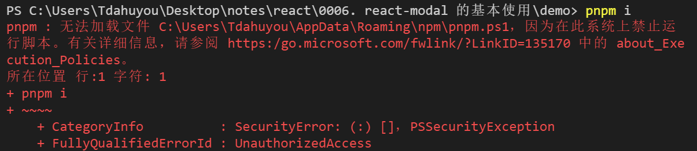

## 1. 报错日志示例



## 2. 修改 Power Shell 执行策略 - 解决报错

该问题是由于 PowerShell 的执行策略设置导致的，该策略限制了脚本的运行。要解决这个问题，可以更改 PowerShell 的执行策略来允许运行本地脚本。请按照以下步骤操作：

1. 以管理员身份打开 PowerShell：您可以通过在开始菜单搜索`PowerShell`，然后右键点击`Windows PowerShell`并选择`以管理员身份运行`来实现。
2. 查看当前的执行策略：在 PowerShell 中输入以下命令来查看当前的执行策略：

```powershell
Get-ExecutionPolicy
```

3. 更改执行策略：如果当前策略不允许运行脚本（例如，默认可能是`Restricted`），您可以将其更改为`RemoteSigned`或`Unrestricted`。`RemoteSigned`要求从互联网下载的脚本必须具有数字签名，而`Unrestricted`则允许所有脚本运行，但可能不太安全。推荐使用`RemoteSigned`。

要更改执行策略，请在 PowerShell 中输入以下命令之一：

```powershell
Set-ExecutionPolicy RemoteSigned
```

或者

```powershell
Set-ExecutionPolicy Unrestricted
```

4. 确认更改：系统会询问您是否确认更改执行策略，输入`Y`或`A`来确认。
5. 重新尝试运行您的命令：完成上述步骤后，再次尝试运行`pnpm i`命令。

如果您不希望更改整个系统的执行策略，还可以考虑只针对特定的 PowerShell 会话临时更改执行策略，使用`-Scope Process`参数：

```powershell
Set-ExecutionPolicy -Scope Process -ExecutionPolicy Bypass
```

这将仅影响当前的 PowerShell 进程，并且在关闭 PowerShell 窗口后不会保留更改。

请注意，在修改执行策略时应谨慎行事，因为这可能会影响系统的安全性。确保理解每种执行策略的含义和潜在风险。
