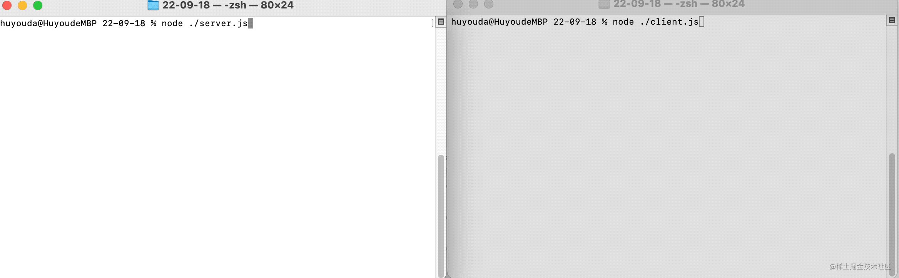

## 1. 概述

- 创建一个 TCP 服务器：`net.createServer()`
- 服务端监听 xxx 端口：`server.listen(xxx, <接收到客户端请求时触发的回调>)`
- 服务端监听来自客户端的连接：`server.on('connection', <客户端发送连接时触发的回调>)`
  - 回调函数接收的第一个参数是请求连接的客户端与当前的服务端建立的 socket
  - 服务端通过这个 socket 和对应的客户端进行通信
  - 监听客户端发送的请求消息：`socket.on('data', <客户端发送请求时触发的回调>)`
  - 服务端响应来自客户端的请求：`socket.write('...')`
  - 服务端监听客户端关闭连接：`socket.on('end', <连接断开时触发的回调>)`
  - 服务端手动关闭连接：`socket.end()`
- 创建一个 TCP 客户端：`net.createConnection(<需连接的服务端参数>[, <连接成功后的回调>])`
- 客户端向服务端发起请求：`client.write('...')`
- 客户端监听服务端的响应：`client.on('data', <服务端响应消息时触发的回调>)`
  - 回调函数接收的第一个参数是服务端给客户端响应的内容
- 客户端监听服务端关闭连接：`client.on('end', <连接断开时触发的回调>)`
- 客户端手动关闭连接：`client.end()`
- 本节内容：实现几个小 demo，体验一下 Node.js 的 net 模块，👇 是 demo 的功能描述：
  - demo1：使用 Node.js 的 net 模块，搭建一个简单的本地服务，分别定义 TCP 客户端、服务端，并实现简单的本地通信。
  - demo2：写一个 TCP 客户端来模拟 http 请求，向 `www.baidu.com` 发起请求，并将接收到的响应体内容原样输出，接收完毕后，关闭连接。
  - demo3：写一个 TCP 服务端来模拟 web 服务器，作用是返回一张图片。要求可以使用浏览器成功请求到该服务，并将请求到的 **图片** 给渲染出来。

## 2. demos.1 - 体验 net 模块

- 使用 Node.js 的 net 模块，搭建一个简单的本地服务，分别定义 TCP 客户端、服务端，并实现简单的本地通信。

::: code-group

```js [client.cjs]
const net = require('net')

// 创建客户端
const client = net.createConnection(
  {
    port: 2155,
    host: 'localhost',
  },
  () => {
    console.log('成功连接服务端')
  },
)

// 监听来自服务端的消息
client.on('data', (chunk) => {
  console.log('来自服务端的消息：', chunk.toString())
  client.end() // 客户端主动关闭连接
})

// 向服务端发送请求
client.write('你好，我是客户端')

// 注册监听请求断开的事件
client.on('end', () => {
  console.log('连接断开了')
})
```

```js [server.cjs]
const net = require('net')

const server = net.createServer()

server.listen(2155, () => {
  console.log('开始监听 2155 端口')
})

server.on('connection', (socket) => {
  console.log('监听到有客户端连接该服务')

  socket.on('data', (chunk) => {
    console.log('接收到来自客户端的数据', '\n=> ', chunk.toString())

    socket.write(
      `你好，我是服务端，我已经收到了你发送来的数据 => ${chunk.toString()}`,
      'utf-8',
    )
  })

  socket.on('end', () => {
    console.log('连接断开了')
  })
})
```

:::

- 执行以下命令，查看最终效果：
  - 启动服务端：`node ./server.cjs`
  - 启动客户端：`node ./client.cjs`
- 最终效果：
  - 

## 3. demos.2 - 模拟 http 请求

- 写一个 TCP 客户端来模拟 http 请求，向 `www.baidu.com` 发起请求，并将接收到的响应体内容原样输出，接收完毕后，关闭连接。
- 先来看看最终效果：
  - 接收到的数据：
  - 
  - 解析后的数据：
  - 

::: code-group

```js [client.cjs]
const net = require('net')
const responseData = {
  line: null, // 响应行
  header: null, // 响应头
  body: '', // 响应体
}
const separator = '\r\n' // 分隔符

// 创建客户端
const client = net.createConnection(
  {
    port: 80, // HTTP 协议，默认端口 80
    host: 'www.baidu.com', // default val => 'localhost'
  },
  () => {
    // 连接成功之后的回调
    console.log('连接成功~')
  },
)

// 发送请求
client.write(`GET / HTTP/1.1
Connection: keep-alive
Host: www.baidu.com

`)

// 监听响应
client.on('data', (chunk) => {
  console.log('chunk => ', chunk.toString('utf-8'))
  if (!responseData.line) {
    // 第一次收到的响应消息
    // 解析第一次接收到的 chunk 获取到响应行、响应头以及响应体的部分信息
    parseResponse(chunk.toString('utf-8'))
  } else {
    // 非第一次接收到的响应消息
    responseData.body += chunk.toString('utf-8')
  }
  isOver()
})

// 监听断开
client.on('close', () => {
  console.log('连接断开~')
})

/**
 * 解析响应消息
 * @param {String} response 响应消息
 */
function parseResponse(response) {
  const lineEndIndex = response.indexOf(separator) // => 响应行的结束位置
  const headerEndIndex = response.indexOf(separator + separator) // => 响应头的结束位置

  const lineStr = response.slice(0, lineEndIndex)
  const headerStr = response.slice(lineEndIndex + 2, headerEndIndex)
  const bodyStr = response.slice(headerEndIndex + 4)

  const lineArr = lineStr.split(' ')
  const headerArr = headerStr.split(separator)

  // 响应行
  responseData.line = {
    HTTPVersion: lineArr[0], // => 协议版本
    StatusCode: lineArr[1], // => 状态码
    ReasonPhrase: lineArr[2], // => 状态码描述
  }

  // 响应头
  responseData.header = headerArr
    .map((it) => {
      const keyEndIndex = it.indexOf(': '),
        key = it.slice(0, keyEndIndex),
        val = it.slice(keyEndIndex + 2)
      return [key, val]
    })
    .reduce((a, b) => {
      a[b[0]] = b[1]
      return a
    }, {})

  // 响应体
  responseData.body = bodyStr
}

/**
 * 判断来自服务器的消息是否已经接收完毕
 */
function isOver() {
  const contentLength = +responseData.header['Content-Length'],
    curLen = Buffer.from(responseData.body).byteLength

  // 消息接收完毕
  if (curLen >= contentLength) {
    client.end() // 关闭连接
  }
}
```

:::

- **下面简单分析一下 demo2 的实现流程**：
  - 创建客户端 `const client = net.createConnection(options, cb)`，其中回调 `cb` 会在连接成功时触发一次。
  - 注册监听函数 `client.on('data', (chunk) => { ... })`
  - data 事件在每次接收到来自服务端的消息时，都会触发。
  - 第一次接收到响应消息时，解析出响应行、响应头信息。之后每次监听到响应消息，都是 **剩下** 的响应体的消息，只要不断拼接到响应体中即可。
  - 每次接收完消息后，都要判断来自服务端的消息是否已经接收完毕了，如果接收完毕了，则需要断开链接。
- 发送请求 `client.write()`
- 断开连接 `client.end()`
  - 判断是否需要断开连接，可以借助解析出的响应头的 `Content-Length` 字段来判断。
  - ① 服务端返回的响应体消息的总字节数：`Content-Length` 的值
  - ② 当前接收到的消息的总字节数：`Buffer.from(目前接收到的服务端消息体字符串, 'utf-8').byteLength`
  - 一旦 `② >= ①`，那么意味着服务端吐给我们的数据，我们都拿到了，此时需要断开可服务端的连接。
- **主要解决几个问题**：
  - 如何创建客户端，建立与服务端的链接
  - 如何使用客户端发送 HTTP 请求
  - 如何拿到服务端返回的 HTTP 响应数据
  - 如何判断服务端响应的内容是否都接收完毕，并在接收完毕之后，关闭连接
- **补充**：
  - 响应消息中，有些字段是重复的，暂时还不理解这些重复的 key 是干啥的，使用上述逻辑处理的最终结果是，后者覆盖前者。
  - 

## 4. demos.3 - 实现一个简单的 web 服务 - 向浏览器响应图片

- 写一个 TCP 服务端来模拟 web 服务器，作用是返回一张图片。要求可以使用浏览器成功请求到该服务，并将请求到的 **图片** 给渲染出来。
- 模拟 HTTP 服务器，使用浏览器访问该服务，得到一个静态资源，`http://localhost:2155/` 使用浏览器访问本地搭建的一个服务，可以获取到我们返回的静态资源。
- 
- **👇 下面来简单介绍一下流程**：
  - **初始化**：
    - 创建服务端：`const localServer = net.createServer()`
    - 监听 2155 端口：`localServer.listen(2155, () => {})` 注意：回调函数仅会在客户端连接 2155 端口成功时触发一次。
    - 监听来自客户端的连接请求：`localServer.on("connection", (socket) => {})` 注意：每次有客户端连接，都会触发 connection 事件。每个客户端都对应一个 socket，每个 socket 之间是相互独立的。
- **处理 socket**：
  - 注册监听事件：`socket.on("data", (chunk) => {})` 注册 data 事件，每次接收到来自客户端的数据时触发
  - 注册 end 事件，连接断开时触发：`socket.on('end', () => {})`
- **准备响应的数据：响应数据 = 响应头 + 响应体**
  - 响应体：读取静态文件资源（buffer 格式）稍后作为 响应体 返回：`const bodyBuffer = await fs.promises.readFile(path.resolve(__dirname, './xxx'))`
  - 响应数据：拼接响应头和响应体，并返回给客户端：`socket.write(Buffer.concat([headBuffer, bodyBuffer]))`
  - 断开连接：`socket.end()`

```javascript
const headBuffer = Buffer.from(
  `HTTP/1.1 200 OK
Content-Type: image/jpeg

`,
  'utf-8',
)
```

::: code-group

```js [server.cjs]
const net = require('net')
const path = require('path')
const fs = require('fs')
const localServer = net.createServer()

localServer.listen(2155, () => {
  console.log('开始监听 2155 端口')
}) // => 监听 2155 端口

localServer.on('connection', (socket) => {
  console.log('有客户端连接到该服务了')

  socket.on('data', async (chunk) => {
    console.log('接收到来自客户端的数据：', chunk.toString('utf-8'))

    const headBuffer = Buffer.from(
      `HTTP/1.1 200 OK
Content-Type: image/jpeg

`,
      'utf-8',
    )

    // 读取本地头像文件 avatar.jpeg
    const filename = path.resolve(__dirname, './avatar.jpeg')
    // const filename = path.resolve(__dirname, "./index.html");
    const bodyBuffer = await fs.promises.readFile(filename)

    socket.write(Buffer.concat([headBuffer, bodyBuffer]))
    socket.end()
  })

  socket.on('end', () => {
    console.log('连接关闭了')
  })
})
```

:::

## 5. 引用

- https://nodejs.org/api/net.html#netcreateconnection
  - nodejs net 模块
  - `net.createConnection()` 可用于创建客户端/服务端。
