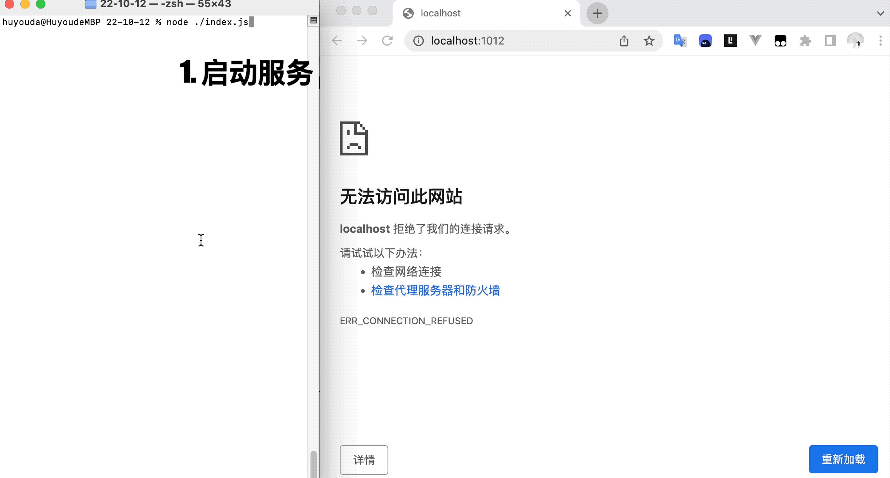

## 1. 概述

- 本篇文档的主要内容：介绍如何使用 Node.js 的 http 模块来搭建一个本地的静态资源服务器。
- **目录结构**：

```bash
.
├── 1.cjs
└── resources # 存放资源文件
    ├── avatar.png
    ├── css
    │   └── index.css
    ├── index.html
    └── test
        └── index.html
```

- **测试地址**：
  - 访问首页
    - http://localhost:1012
    - http://localhost:1012/
  - 访问 test 目录：http://localhost:1012/test
  - 访问样式资源：http://localhost:1012/css/index.css
  - 访问图片资源：http://localhost:1012/avatar.png
- **查看最终效果**：
  - 
  - 注：这是早期写的笔记，当时的源码资源懒得找了，就按照相同的资源目录结构，简单还原了大致的场景。其中有些图片和内容是对不上的，而这些并非重点，不要 care 就好。

## 2. demos.1 - 基于 http 模块实现的一个简单的静态资源服务

::: code-group

```js [1.cjs]
const http = require('http')
const fs = require('fs/promises')
const path = require('path')

/**
 * 获取文件状态
 * @param {String} filename 文件的绝对路径
 * @returns 文件状态，如果绝对路径没法找到对应的文件，返回 null
 */
async function getFileStat(filename) {
  try {
    const stat = await fs.stat(filename)
    return stat
  } catch (e) {
    return null
  }
}

/**
 * 依据传入的请求资源路径，返回对应的文件内容
 * @param {String} url 请求的资源路径
 * @returns 文件内容，如果文件不存在，返回 null
 */
async function getFileContent(url) {
  // 处理 url
  url = url.replace(/^\//, '').replace(/\/$/, '')
  url = url === '' ? 'index.html' : url
  console.log('请求静态资源：', url)

  // 获取文件信息
  const filename = path.resolve(__dirname, 'resources', url)
  const stat = await getFileStat(filename)
  if (stat) {
    // 资源存在
    if (stat.isDirectory()) {
      // 是目录
      const childFilename = path.resolve(filename, 'index.html')
      const childStat = await getFileStat(childFilename)

      if (!childStat) return null
      else return await fs.readFile(childFilename)
    } else {
      // 是文件
      return await fs.readFile(filename)
    }
  } else {
    // 资源不存在
    return null
  }
}

const server = http.createServer(async (req, res) => {
  const content = await getFileContent(req.url)

  if (content) {
    res.statusCode = 200
    res.write(content)
  } else {
    res.statusCode = 404

    res.setHeader('Content-Type', 'text/plain;charset=UTF-8')
    // charset=UTF-8 在响应中主动告诉浏览器使用UTF-8编码格式来接收数据
    // text/plain 纯文本格式
    res.write('资源不存在')
  }

  res.end()
})

server.on('listening', () => {
  console.log('listen 1012')
  console.log('启动服务，开始监听 1012 端口')
})

server.listen(1012)
```

:::

## 3. 引用

- https://nodejs.org/api/http.html#httpcreateserveroptions-requestlistener
  - Node.js - `http.createServer([options][, requestListener])`
