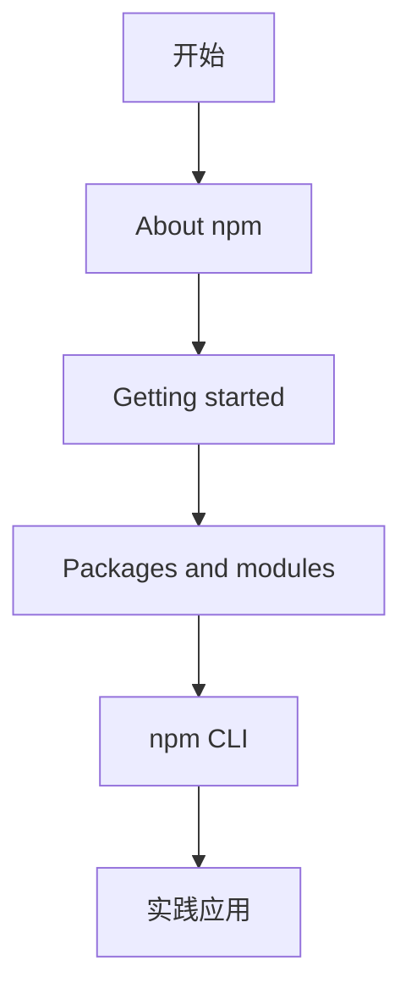

# [0086. npm 官网](https://github.com/tnotesjs/TNotes.nodejs/tree/main/notes/0086.%20npm%20%E5%AE%98%E7%BD%91)

<!-- region:toc -->

- [1. 🎯 本节内容](#1--本节内容)
- [2. 🫧 评价](#2--评价)
- [3. 🤔 npm 官网包含哪些主要内容？](#3--npm-官网包含哪些主要内容)
  - [3.1. 文档结构概览](#31-文档结构概览)
  - [3.2. About npm（关于 npm）](#32-about-npm关于-npm)
  - [3.3. Getting started（入门指南）](#33-getting-started入门指南)
  - [3.4. Packages and modules（包与模块）](#34-packages-and-modules包与模块)
  - [3.5. Integrations（集成功能）](#35-integrations集成功能)
  - [3.6. Organizations（组织管理）](#36-organizations组织管理)
  - [3.7. Policies（策略管理）](#37-policies策略管理)
  - [3.8. Threats and mitigations（威胁与缓解措施）](#38-threats-and-mitigations威胁与缓解措施)
  - [3.9. npm CLI（命令行工具）](#39-npm-cli命令行工具)
- [4. 🤔 如何快速查找 npm 相关文档？](#4--如何快速查找-npm-相关文档)
  - [4.1. 方法一：使用官网搜索](#41-方法一使用官网搜索)
  - [4.2. 方法二：直接访问文档分类](#42-方法二直接访问文档分类)
  - [4.3. 方法三：使用命令行帮助](#43-方法三使用命令行帮助)
  - [4.4. 方法四：访问 GitHub 仓库](#44-方法四访问-github-仓库)
  - [4.5. 推荐学习路径](#45-推荐学习路径)
- [5. 🔗 引用](#5--引用)

<!-- endregion:toc -->

## 1. 🎯 本节内容

- npm 官网的主要内容结构简介
- 各文档板块的功能说明
- npm help 命令的使用方法

## 2. 🫧 评价

npm 官网是学习和使用 npm 的权威资料来源。

- 遇到 npm 相关问题时，优先查阅官方文档而不是依赖二手资料
- npm CLI 文档是日常开发中最常用的部分，建议重点学习
- Getting started 和 Packages and modules 部分适合新手入门
- Organizations 和 Policies 部分主要面向企业用户和包发布者

官方文档简单搂一眼就完事儿，核心目标是：当你需要查阅 npm 相关资料时，能够快速定位到相关内容。

## 3. 🤔 npm 官网包含哪些主要内容？

npm 官网地址：https://www.npmjs.com/


### 3.1. 文档结构概览


```txt
npm 官方文档
├── About npm             # npm 简介
├── Getting started       # 入门指南
├── Packages and modules  # 包与模块
├── Integrations         # 集成功能
├── Organizations        # 组织管理
├── Policies             # 策略管理
├── Threats and mitigations  # 安全威胁
└── npm CLI              # 命令行工具（重点）
└── GitHub               # GitHub 仓库
```

### 3.2. About npm（关于 npm）

对 npm 的基本概念进行介绍：

- npm 是什么
- npm 的核心功能
- npm 的发展历史

### 3.3. Getting started（入门指南）

环境配置和初始化相关内容：

- Node.js 和 npm 的安装
- npm 账号注册和配置
- 环境初始化步骤
- 常见问题解决方案

```bash
# 查看 npm 版本
npm --version

# 初始化项目
npm init

# 配置 npm 账号
npm login
```

### 3.4. Packages and modules（包与模块）

包和模块的核心概念及操作：

| 类型 | 内容                                |
| ---- | ----------------------------------- |
| 概念 | package 定义、module 定义、两者区别 |
| 类型 | 公共包、私有包、作用域包            |
| 操作 | 搜索、安装、卸载、更新、发布        |

```bash
# 搜索包
npm search express

# 安装包
npm install express

# 发布包
npm publish
```

### 3.5. Integrations（集成功能）

将 npm 集成到外部服务：

- GitHub Actions 集成
- CI/CD 工具集成
- 其他开发工具集成

### 3.6. Organizations（组织管理）

企业级团队协作功能：

- 创建和管理组织
- 成员权限管理
- 团队管理
- 组织内包管理

注意：个人开发者通常不需要关注这部分内容

### 3.7. Policies（策略管理）

使用 npm 时需要遵守的规则：

- 使用条款
- 隐私保护政策
- 包发布和删除规则
- 版权和商标政策
- 行为准则

### 3.8. Threats and mitigations（威胁与缓解措施）

npm 面临的安全威胁及应对：

- 常见攻击类型
- 安全最佳实践
- 漏洞报告流程
- 安全更新机制

### 3.9. npm CLI（命令行工具）

npm 命令行工具的完整文档：

- 所有 npm 命令的详细说明
- 命令参数和选项
- 使用示例和最佳实践
- 配置选项说明

```bash
# 查看命令帮助
npm help install
npm help publish

# 查看所有命令
npm help
```

这是日常开发中最常用的部分，建议重点学习。

## 4. 🤔 如何快速查找 npm 相关文档？

### 4.1. 方法一：使用官网搜索

1. 访问 https://www.npmjs.com/
2. 使用页面顶部的搜索框
3. 输入关键词查找

### 4.2. 方法二：直接访问文档分类

根据需求直接进入对应板块：

```txt
初学者     → Getting started
包操作     → Packages and modules
命令使用   → npm CLI
安全问题   → Threats and mitigations
```

### 4.3. 方法三：使用命令行帮助

```bash
# 查看特定命令的帮助文档
npm help <command>

# 示例
npm help install
npm help publish
npm help config
```

### 4.4. 方法四：访问 GitHub 仓库

官方文档的 GitHub 仓库：

- 仓库地址：https://github.com/npm/documentation
- 可以提交问题和建议
- 查看文档更新历史

### 4.5. 推荐学习路径



1. 先阅读 About npm 了解基本概念
2. 按照 Getting started 完成环境配置
3. 学习 Packages and modules 掌握包管理
4. 重点学习 npm CLI 命令
5. 在实践中遇到问题时查阅对应文档

## 5. 🔗 引用

- [npm 官网][1]
- [npm 官方文档][2]
- [npm GitHub 仓库][3]
- [npm CLI 文档][4]

[1]: https://www.npmjs.com/
[2]: https://docs.npmjs.com/
[3]: https://github.com/npm/documentation
[4]: https://docs.npmjs.com/cli/
