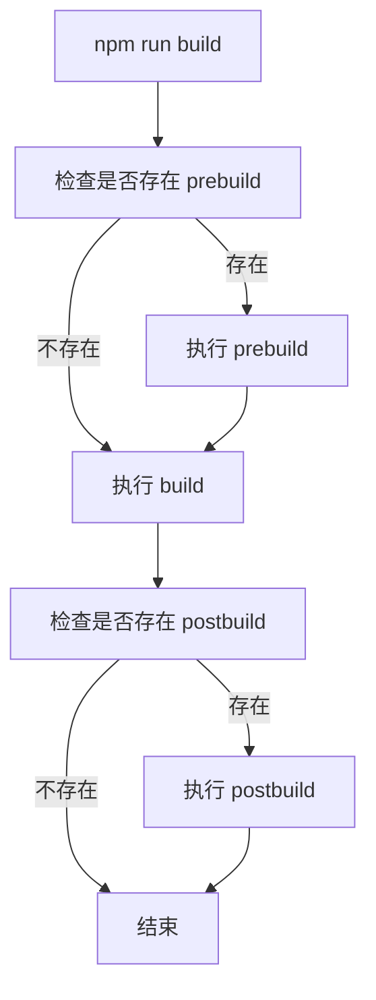

# [0098. npm scripts 高级用法](https://github.com/tnotesjs/TNotes.nodejs/tree/main/notes/0098.%20npm%20scripts%20%E9%AB%98%E7%BA%A7%E7%94%A8%E6%B3%95)

<!-- region:toc -->

- [1. 🎯 本节内容](#1--本节内容)
- [2. 🫧 评价](#2--评价)
- [3. 🤔 什么是 npm scripts？](#3--什么是-npm-scripts)
  - [3.1. 基本使用](#31-基本使用)
  - [3.2. 特殊脚本](#32-特殊脚本)
- [4. 🤔 如何传递参数给 npm scripts？](#4--如何传递参数给-npm-scripts)
  - [4.1. 传递单个参数](#41-传递单个参数)
  - [4.2. 传递多个参数](#42-传递多个参数)
  - [4.3. 在脚本内使用变量](#43-在脚本内使用变量)
- [5. 🤔 如何在 npm scripts 中执行多个命令？](#5--如何在-npm-scripts-中执行多个命令)
  - [5.1. 串行执行（按顺序）](#51-串行执行按顺序)
  - [5.2. 并行执行（同时）](#52-并行执行同时)
  - [5.3. 使用 npm-run-all](#53-使用-npm-run-all)
- [6. 🤔 如何在 npm scripts 中使用环境变量？](#6--如何在-npm-scripts-中使用环境变量)
  - [6.1. 使用 cross-env](#61-使用-cross-env)
  - [6.2. 使用 dotenv](#62-使用-dotenv)
  - [6.3. npm 内置环境变量](#63-npm-内置环境变量)
- [7. 🤔 如何访问 package.json 中的字段？](#7--如何访问-packagejson-中的字段)
  - [7.1. 通过环境变量访问](#71-通过环境变量访问)
  - [7.2. 命名规则](#72-命名规则)
- [8. 🤔 npm scripts 的生命周期钩子有哪些？](#8--npm-scripts-的生命周期钩子有哪些)
  - [8.1. 基本钩子](#81-基本钩子)
  - [8.2. 常见生命周期](#82-常见生命周期)
  - [8.3. 实际应用场景](#83-实际应用场景)
  - [8.4. 钩子执行流程图](#84-钩子执行流程图)
- [9. 🤔 如何让 npm scripts 支持跨平台？](#9--如何让-npm-scripts-支持跨平台)
  - [9.1. 常见跨平台问题](#91-常见跨平台问题)
  - [9.2. 解决方案](#92-解决方案)
    - [使用跨平台工具包](#使用跨平台工具包)
  - [9.3. 使用 shx](#93-使用-shx)
- [10. 🤔 如何在 npm scripts 中使用通配符？](#10--如何在-npm-scripts-中使用通配符)
  - [10.1. 使用 glob 模式](#101-使用-glob-模式)
  - [10.2. 使用 glob 包](#102-使用-glob-包)
  - [10.3. 脚本名称通配符](#103-脚本名称通配符)
- [11. 🤔 如何在 npm scripts 中使用本地安装的包？](#11--如何在-npm-scripts-中使用本地安装的包)
  - [11.1. npm 自动查找](#111-npm-自动查找)
  - [11.2. 使用 npx](#112-使用-npx)
  - [11.3. 手动指定路径](#113-手动指定路径)
- [12. 🤔 如何简化长命令？](#12--如何简化长命令)
  - [12.1. 拆分为多个脚本](#121-拆分为多个脚本)
  - [12.2. 提取到独立文件](#122-提取到独立文件)
  - [12.3. 使用配置文件](#123-使用配置文件)
- [13. 🤔 如何调试 npm scripts？](#13--如何调试-npm-scripts)
  - [13.1. 查看实际执行的命令](#131-查看实际执行的命令)
  - [13.2. 添加调试输出](#132-添加调试输出)
  - [13.3. 使用 npm 调试模式](#133-使用-npm-调试模式)
  - [13.4. 查看执行的脚本](#134-查看执行的脚本)
  - [13.5. 使用环境变量调试](#135-使用环境变量调试)
- [14. 🔗 引用](#14--引用)

<!-- endregion:toc -->

## 1. 🎯 本节内容

- npm scripts 参数传递
- 多命令执行（串行、并行）
- 环境变量使用
- 生命周期钩子
- 跨平台命令
- 通配符和变量访问
- 调试技巧

## 2. 🫧 评价

npm scripts 是 `package.json` 中的脚本系统，可以自动化项目中的各种任务。

- 掌握高级用法能显著提升开发效率，避免重复输入复杂命令
- 善用生命周期钩子可以自动化工作流，如安装后自动构建
- 跨平台脚本需要特别注意，推荐使用专门的工具包来处理
- 对于复杂任务，建议将脚本逻辑提取到独立的 JS 文件中

## 3. 🤔 什么是 npm scripts？

npm scripts 是定义在 `package.json` 文件中 `scripts` 字段的命令集合。

### 3.1. 基本使用

```json
{
  "scripts": {
    "start": "node index.js",
    "test": "jest",
    "build": "webpack --mode production"
  }
}
```

执行方式：

```bash
npm run start
npm run test
npm run build

# 特殊脚本可以省略 run
npm start
npm test
```

### 3.2. 特殊脚本

以下脚本可以省略 `run` 关键字：

- `npm start` = `npm run start`
- `npm stop` = `npm run stop`
- `npm test` = `npm run test`
- `npm restart` = `npm run restart`

## 4. 🤔 如何传递参数给 npm scripts？

使用 `--` 分隔符可以将参数传递给脚本命令。

### 4.1. 传递单个参数

::: code-group

```json [package.json]
{
  "scripts": {
    "serve": "webpack serve"
  }
}
```

```bash [执行命令]
# 传递 port 参数
npm run serve -- --port 8080

# 实际执行：webpack serve --port 8080
```

:::

### 4.2. 传递多个参数

```bash
npm run serve -- --port 8080 --open --hot

# 实际执行：webpack serve --port 8080 --open --hot
```

### 4.3. 在脚本内使用变量

::: code-group

```json [package.json]
{
  "scripts": {
    "build": "node build.js"
  }
}
```

```javascript [build.js]
// 获取传递的参数
const args = process.argv.slice(2)
console.log('参数列表：', args)

// 解析参数
const port = args.find((arg) => arg.startsWith('--port='))?.split('=')[1]
console.log('端口号：', port)
```

```bash [执行命令]
npm run build -- --port=8080 --env=production

# 输出：
# 参数列表： [ '--port=8080', '--env=production' ]
# 端口号： 8080
```

:::

## 5. 🤔 如何在 npm scripts 中执行多个命令？

### 5.1. 串行执行（按顺序）

使用 `&&` 连接命令，前一个命令成功后才执行下一个。

```json
{
  "scripts": {
    "build": "npm run clean && npm run compile && npm run minify"
  }
}
```

特点：

- 如果某个命令失败，后续命令不会执行
- 适用于有依赖关系的任务序列

### 5.2. 并行执行（同时）

使用 `&` 连接命令，所有命令同时执行。

```json
{
  "scripts": {
    "watch": "npm run watch:js & npm run watch:css"
  }
}
```

⚠️ 注意：`&` 在 Windows cmd 中不支持，建议使用 `npm-run-all` 等工具。

### 5.3. 使用 npm-run-all

安装：

```bash
npm install npm-run-all --save-dev
```

使用：

::: code-group

```json [串行执行]
{
  "scripts": {
    "clean": "rimraf dist",
    "build:js": "webpack",
    "build:css": "sass src:dist",
    "build": "npm-run-all clean build:*"
  }
}
```

```json [并行执行]
{
  "scripts": {
    "watch:js": "webpack --watch",
    "watch:css": "sass --watch src:dist",
    "watch": "npm-run-all --parallel watch:*"
  }
}
```

:::

通配符匹配：

- `build:*` 匹配所有以 `build:` 开头的脚本
- `test:unit` 和 `test:e2e` 可以通过 `test:*` 一起执行

## 6. 🤔 如何在 npm scripts 中使用环境变量？

### 6.1. 使用 cross-env

`cross-env` 可以跨平台设置环境变量。

安装：

```bash
npm install cross-env --save-dev
```

使用：

::: code-group

```json [package.json]
{
  "scripts": {
    "dev": "cross-env NODE_ENV=development webpack serve",
    "build": "cross-env NODE_ENV=production webpack"
  }
}
```

```javascript [webpack.config.js]
// 读取环境变量
const isDev = process.env.NODE_ENV === 'development'

module.exports = {
  mode: process.env.NODE_ENV,
  // ...
}
```

:::

### 6.2. 使用 dotenv

`dotenv` 可以从 `.env` 文件加载环境变量。

安装：

```bash
npm install dotenv --save-dev
```

使用：

::: code-group

```env [.env]
API_URL=https://api.example.com
API_KEY=your_secret_key
PORT=3000
```

```javascript [app.js]
// 在入口文件中加载
require('dotenv').config()

console.log(process.env.API_URL) // https://api.example.com
console.log(process.env.PORT) // 3000
```

```json [package.json]
{
  "scripts": {
    "start": "node -r dotenv/config app.js"
  }
}
```

:::

### 6.3. npm 内置环境变量

npm 自动提供一些环境变量：

```javascript
// package.json 中的字段会自动注入
console.log(process.env.npm_package_name) // 包名
console.log(process.env.npm_package_version) // 版本号
console.log(process.env.npm_lifecycle_event) // 当前执行的脚本名
```

## 7. 🤔 如何访问 package.json 中的字段？

### 7.1. 通过环境变量访问

npm 会将 `package.json` 中的所有字段作为环境变量注入。

::: code-group

```json [package.json]
{
  "name": "my-app",
  "version": "1.2.3",
  "config": {
    "port": "8080"
  },
  "scripts": {
    "start": "node server.js"
  }
}
```

```javascript [server.js]
// 访问 package.json 字段
console.log(process.env.npm_package_name) // my-app
console.log(process.env.npm_package_version) // 1.2.3
console.log(process.env.npm_package_config_port) // 8080

// 访问当前脚本名称
console.log(process.env.npm_lifecycle_event) // start
```

:::

### 7.2. 命名规则

- 字段名转换为大写并用下划线连接
- 嵌套字段使用下划线分隔
- 前缀统一为 `npm_package_`

示例：

```json
{
  "author": {
    "name": "张三",
    "email": "zhangsan@example.com"
  }
}
```

访问方式：

```javascript
process.env.npm_package_author_name // 张三
process.env.npm_package_author_email // zhangsan@example.com
```

## 8. 🤔 npm scripts 的生命周期钩子有哪些？

npm 为脚本提供了前置和后置钩子，命名规则为 `pre<script>` 和 `post<script>`。

### 8.1. 基本钩子

```json
{
  "scripts": {
    "prebuild": "echo 准备构建",
    "build": "webpack",
    "postbuild": "echo 构建完成"
  }
}
```

执行 `npm run build` 时的顺序：

1. `prebuild`
2. `build`
3. `postbuild`

### 8.2. 常见生命周期

| 钩子                     | 触发时机                                     |
| ------------------------ | -------------------------------------------- |
| `preinstall`             | `npm install` 之前                           |
| `install`、`postinstall` | `npm install` 之后                           |
| `prepack`                | `npm pack` 之前                              |
| `prepare`                | `npm install`（无参数）和 `npm publish` 之前 |
| `prepublishOnly`         | `npm publish` 之前                           |
| `preversion`             | `npm version` 之前                           |
| `version`                | `npm version` 之后，提交之前                 |
| `postversion`            | `npm version` 之后，提交之后                 |

### 8.3. 实际应用场景

::: code-group

```json [自动构建]
{
  "scripts": {
    "prepare": "npm run build"
  }
}
```

```json [发布前检查]
{
  "scripts": {
    "prepublishOnly": "npm run test && npm run build"
  }
}
```

```json [版本管理]
{
  "scripts": {
    "preversion": "npm test",
    "version": "npm run build && git add -A dist",
    "postversion": "git push && git push --tags"
  }
}
```

:::

### 8.4. 钩子执行流程图



## 9. 🤔 如何让 npm scripts 支持跨平台？

### 9.1. 常见跨平台问题

不同操作系统的命令差异：

| 操作     | Windows         | Linux/macOS        |
| -------- | --------------- | ------------------ |
| 删除文件 | `del`           | `rm`               |
| 删除目录 | `rmdir /s /q`   | `rm -rf`           |
| 复制文件 | `copy`          | `cp`               |
| 移动文件 | `move`          | `mv`               |
| 清屏     | `cls`           | `clear`            |
| 环境变量 | `set VAR=value` | `export VAR=value` |

### 9.2. 解决方案

#### 使用跨平台工具包

安装常用工具：

```bash
npm install --save-dev cross-env rimraf cpx mkdirp
```

工具说明：

| 工具        | 作用           |
| ----------- | -------------- |
| `cross-env` | 设置环境变量   |
| `rimraf`    | 删除文件和目录 |
| `cpx`       | 复制文件       |
| `mkdirp`    | 创建目录       |

使用示例：

::: code-group

```json [❌ 不跨平台]
{
  "scripts": {
    "clean": "rm -rf dist",
    "build": "set NODE_ENV=production && webpack"
  }
}
```

```json [✅ 跨平台]
{
  "scripts": {
    "clean": "rimraf dist",
    "build": "cross-env NODE_ENV=production webpack"
  }
}
```

:::

### 9.3. 使用 shx

`shx` 提供跨平台的 Unix 命令。

安装：

```bash
npm install shx --save-dev
```

使用：

```json
{
  "scripts": {
    "clean": "shx rm -rf dist",
    "copy": "shx cp -r src dist",
    "mkdir": "shx mkdir -p build/temp"
  }
}
```

支持的命令：

- `cat`、`cd`、`chmod`、`cp`、`echo`
- `ls`、`mkdir`、`mv`、`pwd`、`rm`
- `sed`、`test`、`touch` 等

## 10. 🤔 如何在 npm scripts 中使用通配符？

### 10.1. 使用 glob 模式

在不同平台上，通配符的支持可能不一致。

```json
{
  "scripts": {
    "lint": "eslint src/**/*.js",
    "test": "jest tests/**/*.test.js"
  }
}
```

⚠️ 注意：Windows cmd 默认不支持 `**` 通配符。

### 10.2. 使用 glob 包

安装：

```bash
npm install glob --save-dev
```

创建脚本文件：

::: code-group

```javascript [scripts/lint.js]
const glob = require('glob')
const { execSync } = require('child_process')

// 查找所有匹配的文件
const files = glob.sync('src/**/*.js')

// 执行 lint
files.forEach((file) => {
  console.log(`Linting ${file}`)
  execSync(`eslint ${file}`, { stdio: 'inherit' })
})
```

```json [package.json]
{
  "scripts": {
    "lint": "node scripts/lint.js"
  }
}
```

:::

### 10.3. 脚本名称通配符

使用 `npm-run-all` 可以通过通配符批量执行脚本。

```json
{
  "scripts": {
    "test:unit": "jest tests/unit",
    "test:integration": "jest tests/integration",
    "test:e2e": "cypress run",
    "test": "npm-run-all test:*"
  }
}
```

执行 `npm run test` 会依次执行所有以 `test:` 开头的脚本。

## 11. 🤔 如何在 npm scripts 中使用本地安装的包？

### 11.1. npm 自动查找

npm 会自动将 `node_modules/.bin` 添加到 PATH 中。

```json
{
  "scripts": {
    "lint": "eslint src",
    "test": "jest"
  }
}
```

npm 执行时会自动找到：

- `node_modules/.bin/eslint`
- `node_modules/.bin/jest`

### 11.2. 使用 npx

`npx` 可以直接执行本地安装的包。

```bash
# 不使用 npx
./node_modules/.bin/eslint src

# 使用 npx
npx eslint src
```

在脚本中：

```json
{
  "scripts": {
    "lint": "npx eslint src"
  }
}
```

### 11.3. 手动指定路径

```json
{
  "scripts": {
    "lint": "./node_modules/.bin/eslint src"
  }
}
```

⚠️ 不推荐：路径分隔符在 Windows 上可能有问题。

## 12. 🤔 如何简化长命令？

### 12.1. 拆分为多个脚本

::: code-group

```json [❌ 冗长难读]
{
  "scripts": {
    "build": "cross-env NODE_ENV=production webpack --mode production --config webpack.prod.js --progress --colors"
  }
}
```

```json [✅ 清晰可读]
{
  "scripts": {
    "build": "npm run build:prod",
    "build:prod": "cross-env NODE_ENV=production npm run webpack:build",
    "webpack:build": "webpack --mode production --config webpack.prod.js",
    "webpack:watch": "webpack --watch"
  }
}
```

:::

### 12.2. 提取到独立文件

::: code-group

```json [package.json]
{
  "scripts": {
    "build": "node scripts/build.js"
  }
}
```

```javascript [scripts/build.js]
const { execSync } = require('child_process')

// 设置环境变量
process.env.NODE_ENV = 'production'

// 执行构建
console.log('开始构建...')
execSync('webpack --mode production --config webpack.prod.js', {
  stdio: 'inherit',
})
console.log('构建完成！')
```

:::

### 12.3. 使用配置文件

将复杂配置放在配置文件中：

```json
{
  "scripts": {
    "build": "webpack --config webpack.config.js"
  }
}
```

配置文件中可以使用 JS 逻辑处理复杂情况。

## 13. 🤔 如何调试 npm scripts？

### 13.1. 查看实际执行的命令

使用 `--` 和 `--dry-run` 查看但不执行。

```bash
# 查看完整命令（部分工具支持）
npm run build -- --dry-run

# 或者在脚本中添加 echo
```

### 13.2. 添加调试输出

```json
{
  "scripts": {
    "debug": "echo 当前目录: && pwd && echo 环境: && echo $NODE_ENV",
    "build": "npm run debug && webpack"
  }
}
```

### 13.3. 使用 npm 调试模式

查看详细日志：

```bash
npm run build --loglevel verbose
# 或
npm run build --dd
```

### 13.4. 查看执行的脚本

```bash
# 查看所有可用脚本
npm run

# 查看脚本定义
npm run-script --list
```

### 13.5. 使用环境变量调试

```json
{
  "scripts": {
    "debug": "cross-env DEBUG=* node app.js"
  }
}
```

配合 `debug` 包使用：

```javascript
const debug = require('debug')('app')
debug('应用启动')
```

## 14. 🔗 引用

- [npm Docs - scripts][1]
- [npm Docs - run-script][2]
- [package.json 文档 - scripts][3]

[1]: https://docs.npmjs.com/cli/v10/using-npm/scripts
[2]: https://docs.npmjs.com/cli/v10/commands/npm-run-script
[3]: https://docs.npmjs.com/cli/v10/configuring-npm/package-json#scripts
