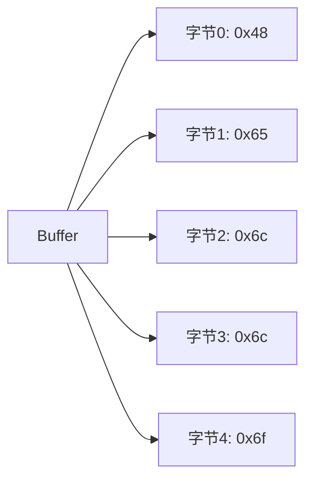

# [0104. Buffer 全局对象](https://github.com/tnotesjs/TNotes.nodejs/tree/main/notes/0104.%20Buffer%20%E5%85%A8%E5%B1%80%E5%AF%B9%E8%B1%A1)

<!-- region:toc -->

- [1. 🎯 本节内容](#1--本节内容)
- [2. 🫧 评价](#2--评价)
- [3. 🤔 什么是 Buffer？](#3--什么是-buffer)
  - [3.1. 定义](#31-定义)
  - [3.2. 特点](#32-特点)
  - [3.3. 内存结构](#33-内存结构)
- [4. 🤔 为什么需要 Buffer？](#4--为什么需要-buffer)
  - [4.1. JavaScript 字符串的局限](#41-javascript-字符串的局限)
  - [4.2. Buffer 的应用场景](#42-buffer-的应用场景)
  - [4.3. 对比示例](#43-对比示例)
- [5. 🤔 如何创建 Buffer？](#5--如何创建-buffer)
  - [5.1. Buffer.from() - 从现有数据创建](#51-bufferfrom---从现有数据创建)
  - [5.2. Buffer.alloc() - 分配指定大小](#52-bufferalloc---分配指定大小)
  - [5.3. Buffer.allocUnsafe() - 快速分配（不清零）](#53-bufferallocunsafe---快速分配不清零)
  - [5.4. 废弃的方式（不推荐）](#54-废弃的方式不推荐)
- [6. 🤔 如何读写 Buffer 中的数据？](#6--如何读写-buffer-中的数据)
  - [6.1. 通过索引读写](#61-通过索引读写)
  - [6.2. write() 方法](#62-write-方法)
  - [6.3. 读取数值类型](#63-读取数值类型)
- [7. 🤔 Buffer 有哪些常用方法？](#7--buffer-有哪些常用方法)
  - [7.1. 信息查询](#71-信息查询)
  - [7.2. 操作方法](#72-操作方法)
  - [7.3. 编码转换](#73-编码转换)
- [8. 🤔 Buffer 与字符串如何相互转换？](#8--buffer-与字符串如何相互转换)
  - [8.1. Buffer 转字符串](#81-buffer-转字符串)
  - [8.2. 字符串转 Buffer](#82-字符串转-buffer)
  - [8.3. 中文处理](#83-中文处理)
  - [8.4. 字节长度计算](#84-字节长度计算)
- [9. 💻 demos.1 - 创建 Buffer](#9--demos1---创建-buffer)
- [10. 💻 demos.2 - 读写 Buffer 数据](#10--demos2---读写-buffer-数据)
- [11. 💻 demos.3 - Buffer 与字符串转换](#11--demos3---buffer-与字符串转换)
- [12. 💻 demos.4 - Buffer 拼接与切片](#12--demos4---buffer-拼接与切片)
- [13. 💻 demos.5 - Buffer 在文件操作中的应用](#13--demos5---buffer-在文件操作中的应用)
- [14. 🔗 引用](#14--引用)

<!-- endregion:toc -->

## 1. 🎯 本节内容

- Buffer 的定义和作用
- Buffer 的创建方式
- Buffer 的读写操作
- Buffer 与字符串的转换
- Buffer 的常用方法
- Buffer 在实际开发中的应用

## 2. 🫧 评价

Buffer 是 Node.js 中用于处理二进制数据的全局类，在文件操作、网络通信等场景中广泛使用。

- Buffer 是 Node.js 特有的，浏览器中使用 TypedArray 或 ArrayBuffer
- 在 Node.js 6.0 之前，直接使用 `new Buffer()` 创建，现已废弃并推荐使用 `Buffer.from()`、`Buffer.alloc()` 等方法
- Buffer 的大小在创建时确定，不能动态调整
- 处理非 UTF-8 编码或二进制数据时，Buffer 是必备工具
- 在处理大文件时，使用 Stream 配合 Buffer 可以避免内存溢出

## 3. 🤔 什么是 Buffer？

Buffer 是 Node.js 提供的用于处理二进制数据的全局类。

### 3.1. 定义

```javascript
// Buffer 是一个全局类，无需引入即可使用
console.log(typeof Buffer) // 'function'
console.log(Buffer === global.Buffer) // true
```

### 3.2. 特点

- 固定大小：Buffer 的大小在创建时就确定了，无法动态调整
- 类似数组：可以通过索引访问和修改每个字节
- 二进制数据：每个元素是 0-255 之间的整数（一个字节）
- 内存分配：直接在 V8 堆外分配物理内存

### 3.3. 内存结构

```javascript
// Buffer 中的每个元素都是一个字节（8位）
const buf = Buffer.from([0x48, 0x65, 0x6c, 0x6c, 0x6f])
console.log(buf) // <Buffer 48 65 6c 6c 6f>
console.log(buf.toString()) // 'Hello'
```



## 4. 🤔 为什么需要 Buffer？

### 4.1. JavaScript 字符串的局限

JavaScript 原生的字符串对于处理二进制数据存在局限：

- 字符串只能处理 UTF-16 编码的文本数据
- 无法有效处理图片、音频、视频等二进制文件
- 在网络传输时需要二进制格式

### 4.2. Buffer 的应用场景

| 场景       | 说明                             |
| ---------- | -------------------------------- |
| 文件操作   | 读写图片、视频、音频等二进制文件 |
| 网络通信   | TCP 数据包、HTTP 请求体等        |
| 加密解密   | 处理加密算法的二进制输入输出     |
| 图像处理   | 处理图片的像素数据               |
| 数据库操作 | 存储和读取 BLOB 类型数据         |

### 4.3. 对比示例

```javascript
// ❌ 字符串无法正确处理二进制数据
const text = String.fromCharCode(0xff, 0xfe)
console.log(text.length) // 2（字符数）
console.log(text.charCodeAt(0)) // 255
console.log(text.charCodeAt(1)) // 254

// ✅ Buffer 可以正确处理
const buf = Buffer.from([0xff, 0xfe])
console.log(buf.length) // 2（字节数）
console.log(buf[0]) // 255
console.log(buf[1]) // 254
```

## 5. 🤔 如何创建 Buffer？

### 5.1. Buffer.from() - 从现有数据创建

从数组创建

```javascript
// 从字节数组创建
const buf1 = Buffer.from([0x48, 0x65, 0x6c, 0x6c, 0x6f])
console.log(buf1) // <Buffer 48 65 6c 6c 6f>
console.log(buf1.toString()) // 'Hello'
```

从字符串创建

```javascript
// 从字符串创建（默认 UTF-8 编码）
const buf2 = Buffer.from('Hello')
console.log(buf2) // <Buffer 48 65 6c 6c 6f>

// 指定编码
const buf3 = Buffer.from('Hello', 'utf8')
const buf4 = Buffer.from('你好', 'utf8')
console.log(buf4) // <Buffer e4 bd a0 e5 a5 bd>
```

从另一个 Buffer 创建（复制）

```javascript
const buf5 = Buffer.from('Hello')
const buf6 = Buffer.from(buf5) // 创建副本
buf6[0] = 0x4a // 修改副本
console.log(buf5.toString()) // 'Hello'（原 Buffer 不变）
console.log(buf6.toString()) // 'Jello'
```

### 5.2. Buffer.alloc() - 分配指定大小

```javascript
// 创建一个 10 字节的 Buffer，用 0 填充
const buf7 = Buffer.alloc(10)
console.log(buf7) // <Buffer 00 00 00 00 00 00 00 00 00 00>

// 创建 Buffer 并指定填充值
const buf8 = Buffer.alloc(5, 0xff)
console.log(buf8) // <Buffer ff ff ff ff ff>

// 创建 Buffer 并用字符串填充
const buf9 = Buffer.alloc(10, 'abc')
console.log(buf9.toString()) // 'abcabcabca'
```

### 5.3. Buffer.allocUnsafe() - 快速分配（不清零）

```javascript
// ⚠️ 分配的内存不会被清零，可能包含旧数据
const buf10 = Buffer.allocUnsafe(10)
console.log(buf10) // 内容不确定，可能是旧的内存数据

// 使用前应该先填充或写入数据
buf10.fill(0) // 手动清零
console.log(buf10) // <Buffer 00 00 00 00 00 00 00 00 00 00>
```

⚠️ 警告：`allocUnsafe` 性能更好，但可能包含敏感数据，使用前务必填充。

### 5.4. 废弃的方式（不推荐）

```javascript
// ❌ Node.js 6.0+ 已废弃，不要使用
const buf11 = new Buffer(10)
const buf12 = new Buffer('Hello')
const buf13 = new Buffer([1, 2, 3])
```

## 6. 🤔 如何读写 Buffer 中的数据？

### 6.1. 通过索引读写

```javascript
const buf = Buffer.from('Hello')

// 读取
console.log(buf[0]) // 72 (0x48, 'H' 的 ASCII 码)
console.log(buf[1]) // 101 (0x65, 'e' 的 ASCII 码)

// 写入
buf[0] = 0x4a // 'J' 的 ASCII 码
console.log(buf.toString()) // 'Jello'

// ⚠️ 超出范围的值会被截断
buf[0] = 256 // 会被截断为 0
buf[1] = 257 // 会被截断为 1
console.log(buf[0], buf[1]) // 0 1
```

### 6.2. write() 方法

```javascript
const buf = Buffer.alloc(10)

// 写入字符串
buf.write('Hello')
console.log(buf.toString()) // 'Hello'

// 指定写入位置
buf.write('World', 5)
console.log(buf.toString()) // 'HelloWorld'

// 指定编码
const buf2 = Buffer.alloc(20)
buf2.write('你好', 0, 'utf8')
console.log(buf2.toString('utf8', 0, 6)) // '你好'
```

### 6.3. 读取数值类型

```javascript
const buf = Buffer.alloc(8)

// 写入数值
buf.writeInt8(127, 0) // 在位置 0 写入 8 位整数
buf.writeInt16LE(1000, 1) // 在位置 1 写入 16 位小端整数
buf.writeInt32LE(100000, 3) // 在位置 3 写入 32 位小端整数

// 读取数值
console.log(buf.readInt8(0)) // 127
console.log(buf.readInt16LE(1)) // 1000
console.log(buf.readInt32LE(3)) // 100000
```

## 7. 🤔 Buffer 有哪些常用方法？

### 7.1. 信息查询

| 方法                                    | 说明                   |
| --------------------------------------- | ---------------------- |
| `buf.length`                            | 返回 Buffer 的字节长度 |
| `buf.toString([encoding])`              | 将 Buffer 转换为字符串 |
| `Buffer.isBuffer(obj)`                  | 判断对象是否为 Buffer  |
| `Buffer.byteLength(string, [encoding])` | 返回字符串的字节长度   |

### 7.2. 操作方法

| 方法 | 说明 |
| --- | --- |
| `buf.fill(value)` | 用指定值填充 Buffer |
| `buf.copy(target, [targetStart], [sourceStart], [sourceEnd])` | 复制 Buffer 数据 |
| `buf.slice([start], [end])` | 切片（共享内存） |
| `buf.subarray([start], [end])` | 切片（共享内存，推荐） |
| `Buffer.concat(list, [totalLength])` | 拼接多个 Buffer |
| `buf.equals(otherBuffer)` | 比较两个 Buffer 是否相同 |
| `buf.compare(otherBuffer)` | 比较 Buffer 的顺序 |

### 7.3. 编码转换

支持的编码格式：

- `utf8`：默认编码
- `utf16le`：UTF-16 小端编码
- `latin1`：ISO-8859-1
- `base64`：Base64 编码
- `hex`：十六进制编码
- `ascii`：ASCII 编码

## 8. 🤔 Buffer 与字符串如何相互转换？

### 8.1. Buffer 转字符串

```javascript
const buf = Buffer.from([0x48, 0x65, 0x6c, 0x6c, 0x6f])

// 完整转换
console.log(buf.toString()) // 'Hello'
console.log(buf.toString('utf8')) // 'Hello'
console.log(buf.toString('hex')) // '48656c6c6f'
console.log(buf.toString('base64')) // 'SGVsbG8='

// 部分转换
console.log(buf.toString('utf8', 0, 2)) // 'He'
```

### 8.2. 字符串转 Buffer

```javascript
// 不同编码
const buf1 = Buffer.from('Hello', 'utf8')
const buf2 = Buffer.from('Hello', 'ascii')
const buf3 = Buffer.from('48656c6c6f', 'hex')
const buf4 = Buffer.from('SGVsbG8=', 'base64')

console.log(buf1.toString()) // 'Hello'
console.log(buf2.toString()) // 'Hello'
console.log(buf3.toString()) // 'Hello'
console.log(buf4.toString()) // 'Hello'
```

### 8.3. 中文处理

```javascript
const buf = Buffer.from('你好世界', 'utf8')
console.log(buf) // <Buffer e4 bd a0 e5 a5 bd e4 b8 96 e7 95 8c>
console.log(buf.length) // 12（字节数）
console.log('你好世界'.length) // 4（字符数）

console.log(buf.toString('utf8')) // '你好世界'
```

### 8.4. 字节长度计算

```javascript
// 字符串长度 vs 字节长度
console.log('Hello'.length) // 5（字符）
console.log(Buffer.byteLength('Hello')) // 5（字节）

console.log('你好'.length) // 2（字符）
console.log(Buffer.byteLength('你好')) // 6（字节，UTF-8）
```

## 9. 💻 demos.1 - 创建 Buffer

::: code-group

```javascript [1-from-array.js]
// 从数组创建 Buffer
const buf1 = Buffer.from([72, 101, 108, 108, 111])
console.log('从数组创建：', buf1)
console.log('转为字符串：', buf1.toString())
console.log('长度：', buf1.length, '字节')

// 从十六进制数组创建
const buf2 = Buffer.from([0x48, 0x65, 0x6c, 0x6c, 0x6f])
console.log('\n从十六进制创建：', buf2)
console.log('转为字符串：', buf2.toString())
```

```javascript [2-from-string.js]
// 从字符串创建 Buffer
const buf1 = Buffer.from('Hello World')
console.log('从字符串创建：', buf1)
console.log('十六进制表示：', buf1.toString('hex'))

// 中文字符串
const buf2 = Buffer.from('你好世界')
console.log('\n从中文创建：', buf2)
console.log('字符数：', '你好世界'.length)
console.log('字节数：', buf2.length)
console.log('转回字符串：', buf2.toString())
```

```javascript [3-alloc.js]
// 分配固定大小的 Buffer
const buf1 = Buffer.alloc(10)
console.log('alloc(10)：', buf1)

const buf2 = Buffer.alloc(5, 1)
console.log('alloc(5, 1)：', buf2)

const buf3 = Buffer.alloc(10, 'a')
console.log('alloc(10, "a")：', buf3)
console.log('转为字符串：', buf3.toString())

// ⚠️ allocUnsafe 的使用
const buf4 = Buffer.allocUnsafe(10)
console.log('\nallocUnsafe(10)：', buf4) // 可能包含旧数据
buf4.fill(0) // 手动清零
console.log('清零后：', buf4)
```

:::

## 10. 💻 demos.2 - 读写 Buffer 数据

::: code-group

```javascript [1-index-access.js]
// 通过索引访问和修改
const buf = Buffer.from('Hello')

console.log('=== 读取 ===')
console.log('buf[0]：', buf[0], '(0x' + buf[0].toString(16) + ')')
console.log('buf[1]：', buf[1], '(0x' + buf[1].toString(16) + ')')

console.log('\n=== 修改 ===')
buf[0] = 0x4a // 'J'
console.log('修改后：', buf.toString())

// ⚠️ 值会被截断到 0-255
buf[0] = 256
console.log('buf[0] = 256 后：', buf[0]) // 0
buf[0] = 257
console.log('buf[0] = 257 后：', buf[0]) // 1
```

```javascript [2-write-method.js]
// 使用 write 方法
const buf = Buffer.alloc(20)

// 基本写入
buf.write('Hello')
console.log('写入 Hello：', buf.toString())

// 指定位置写入
buf.write(' World', 5)
console.log('写入 World：', buf.toString())

// 指定长度写入
const buf2 = Buffer.alloc(5)
const written = buf2.write('HelloWorld', 0, 5)
console.log('\n写入字节数：', written)
console.log('结果：', buf2.toString())
```

```javascript [3-numeric-types.js]
// 读写数值类型
const buf = Buffer.alloc(10)

// 写入不同类型的数值
buf.writeInt8(127, 0) // 8位整数
buf.writeInt16LE(1000, 1) // 16位小端整数
buf.writeInt32LE(100000, 3) // 32位小端整数
buf.writeFloatLE(3.14, 7) // 32位浮点数

console.log('Buffer 内容：', buf)

// 读取数值
console.log('\n读取的数值：')
console.log('Int8：', buf.readInt8(0))
console.log('Int16LE：', buf.readInt16LE(1))
console.log('Int32LE：', buf.readInt32LE(3))
console.log('FloatLE：', buf.readFloatLE(7).toFixed(2))
```

:::

## 11. 💻 demos.3 - Buffer 与字符串转换

::: code-group

```javascript [1-encoding.js]
// 不同编码格式
const text = 'Hello World'
const buf = Buffer.from(text)

console.log('=== Buffer 转不同编码字符串 ===')
console.log('UTF-8：', buf.toString('utf8'))
console.log('Hex：', buf.toString('hex'))
console.log('Base64：', buf.toString('base64'))
console.log('Latin1：', buf.toString('latin1'))

console.log('\n=== 从不同编码创建 Buffer ===')
const hexBuf = Buffer.from('48656c6c6f', 'hex')
console.log('从 Hex：', hexBuf.toString())

const base64Buf = Buffer.from('SGVsbG8=', 'base64')
console.log('从 Base64：', base64Buf.toString())
```

```javascript [2-chinese.js]
// 中文字符处理
const chinese = '你好世界'
const buf = Buffer.from(chinese, 'utf8')

console.log('=== 中文字符串 ===')
console.log('原字符串：', chinese)
console.log('字符数：', chinese.length)
console.log('Buffer：', buf)
console.log('字节数：', buf.length)
console.log('Hex：', buf.toString('hex'))

console.log('\n=== 转回字符串 ===')
console.log('UTF-8：', buf.toString('utf8'))

console.log('\n=== 字节长度对比 ===')
console.log('英文 "Hello"：', Buffer.byteLength('Hello'), '字节')
console.log('中文 "你好"：', Buffer.byteLength('你好'), '字节')
```

```javascript [3-partial-convert.js]
// 部分转换
const buf = Buffer.from('Hello World')

console.log('=== 部分转换 ===')
console.log('完整：', buf.toString())
console.log('前5字节：', buf.toString('utf8', 0, 5))
console.log('后5字节：', buf.toString('utf8', 6))
console.log('中间部分：', buf.toString('utf8', 2, 8))

console.log('\n=== Hex 部分转换 ===')
console.log('完整Hex：', buf.toString('hex'))
console.log('前5字节Hex：', buf.toString('hex', 0, 5))
```

:::

## 12. 💻 demos.4 - Buffer 拼接与切片

::: code-group

```javascript [1-concat.js]
// Buffer 拼接
const buf1 = Buffer.from('Hello')
const buf2 = Buffer.from(' ')
const buf3 = Buffer.from('World')

const result = Buffer.concat([buf1, buf2, buf3])
console.log('拼接结果：', result.toString())
console.log('总长度：', result.length)

// 指定最大长度
const result2 = Buffer.concat([buf1, buf2, buf3], 8)
console.log('\n限制长度(8)：', result2.toString())
console.log('实际长度：', result2.length)
```

```javascript [2-slice.js]
// Buffer 切片（共享内存）
const buf = Buffer.from('Hello World')

const slice1 = buf.slice(0, 5)
console.log('切片 [0:5]：', slice1.toString())

const slice2 = buf.slice(6)
console.log('切片 [6:]：', slice2.toString())

// ⚠️ 修改切片会影响原 Buffer
console.log('\n=== 共享内存测试 ===')
console.log('原 Buffer：', buf.toString())
slice1[0] = 0x4a // 修改切片
console.log('修改切片后：', buf.toString()) // 原 Buffer 也变了
```

```javascript [3-copy.js]
// 复制 Buffer（不共享内存）
const buf = Buffer.from('Hello World')

// 方式1：使用 Buffer.from
const copy1 = Buffer.from(buf)
copy1[0] = 0x4a
console.log('原 Buffer：', buf.toString())
console.log('复制1：', copy1.toString())

// 方式2：使用 copy 方法
const copy2 = Buffer.alloc(5)
buf.copy(copy2, 0, 0, 5)
copy2[0] = 0x4b
console.log('\n原 Buffer：', buf.toString())
console.log('复制2：', copy2.toString())
```

```javascript [4-compare.js]
// Buffer 比较
const buf1 = Buffer.from('ABC')
const buf2 = Buffer.from('ABD')
const buf3 = Buffer.from('ABC')

console.log('=== equals 比较 ===')
console.log('buf1.equals(buf2)：', buf1.equals(buf2)) // false
console.log('buf1.equals(buf3)：', buf1.equals(buf3)) // true

console.log('\n=== compare 比较 ===')
console.log('buf1.compare(buf2)：', buf1.compare(buf2)) // -1 (小于)
console.log('buf2.compare(buf1)：', buf2.compare(buf1)) // 1 (大于)
console.log('buf1.compare(buf3)：', buf1.compare(buf3)) // 0 (相等)
```

:::

## 13. 💻 demos.5 - Buffer 在文件操作中的应用

::: code-group

```javascript [1-read-file.js]
const fs = require('fs')

// 读取文件为 Buffer
const buffer = fs.readFileSync('example.txt')

console.log('文件内容（Buffer）：', buffer)
console.log('文件大小：', buffer.length, '字节')
console.log('文件内容（字符串）：', buffer.toString())

// 读取二进制文件（如图片）
// const imageBuffer = fs.readFileSync('image.png');
// console.log('图片大小：', imageBuffer.length, '字节');
```

```javascript [2-write-file.js]
const fs = require('fs')

// 从字符串创建 Buffer 并写入文件
const content = 'Hello Node.js!'
const buffer = Buffer.from(content)

fs.writeFileSync('output.txt', buffer)
console.log('文件写入成功')

// 追加写入
const appendContent = Buffer.from('\n追加的内容')
fs.appendFileSync('output.txt', appendContent)
console.log('内容追加成功')
```

```javascript [3-stream-buffer.js]
const fs = require('fs')

// 使用 Stream 处理大文件
const readStream = fs.createReadStream('large-file.txt')

let chunks = []
let totalSize = 0

readStream.on('data', (chunk) => {
  console.log('接收到数据块，大小：', chunk.length, '字节')
  chunks.push(chunk)
  totalSize += chunk.length
})

readStream.on('end', () => {
  const buffer = Buffer.concat(chunks)
  console.log('\n文件读取完成')
  console.log('总大小：', totalSize, '字节')
  console.log('前100字符：', buffer.toString('utf8', 0, 100))
})

readStream.on('error', (err) => {
  console.error('读取错误：', err)
})
```

:::

## 14. 🔗 引用

- [Node.js 官方文档 - Buffer][1]
- [Node.js Buffer 教程][2]
- [MDN - TypedArray][3]

[1]: https://nodejs.org/api/buffer.html
[2]: https://nodejs.org/en/docs/guides/buffer-guide/
[3]: https://developer.mozilla.org/zh-CN/docs/Web/JavaScript/Reference/Global_Objects/TypedArray
