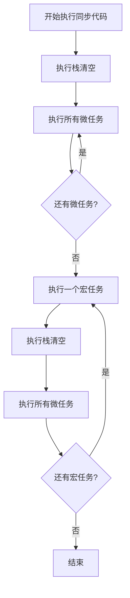

# [0105. queueMicrotask 微任务](https://github.com/tnotesjs/TNotes.nodejs/tree/main/notes/0105.%20queueMicrotask%20%E5%BE%AE%E4%BB%BB%E5%8A%A1)

<!-- region:toc -->

- [1. 🎯 本节内容](#1--本节内容)
- [2. 🫧 评价](#2--评价)
- [3. 🤔 什么是微任务？](#3--什么是微任务)
  - [3.1. 定义](#31-定义)
  - [3.2. 常见的微任务](#32-常见的微任务)
  - [3.3. 事件循环中的位置](#33-事件循环中的位置)
- [4. 🤔 queueMicrotask 是什么？](#4--queuemicrotask-是什么)
  - [4.1. 语法](#41-语法)
  - [4.2. 特点](#42-特点)
  - [4.3. 兼容性](#43-兼容性)
- [5. 🤔 微任务和宏任务有什么区别？](#5--微任务和宏任务有什么区别)
  - [5.1. 对比表格](#51-对比表格)
  - [5.2. 常见的宏任务](#52-常见的宏任务)
  - [5.3. 执行顺序示例](#53-执行顺序示例)
- [6. 🤔 queueMicrotask 与 Promise.then 有什么区别？](#6--queuemicrotask-与-promisethen-有什么区别)
  - [6.1. 功能对比](#61-功能对比)
  - [6.2. 代码对比](#62-代码对比)
  - [6.3. 执行顺序完全相同](#63-执行顺序完全相同)
  - [6.4. 何时使用哪个？](#64-何时使用哪个)
- [7. 🤔 什么时候应该使用 queueMicrotask？](#7--什么时候应该使用-queuemicrotask)
  - [7.1. 适用场景](#71-适用场景)
  - [7.2. 不适用场景](#72-不适用场景)
- [8. 💻 demos.1 - queueMicrotask 基本使用](#8--demos1---queuemicrotask-基本使用)
- [9. 💻 demos.2 - 微任务与宏任务的执行顺序](#9--demos2---微任务与宏任务的执行顺序)
- [10. 💻 demos.3 - queueMicrotask vs Promise](#10--demos3---queuemicrotask-vs-promise)
- [11. 💻 demos.4 - 微任务的实际应用](#11--demos4---微任务的实际应用)
- [12. 💻 demos.5 - 微任务队列阻塞问题](#12--demos5---微任务队列阻塞问题)
- [13. 🔗 引用](#13--引用)

<!-- endregion:toc -->

## 1. 🎯 本节内容

- 微任务的概念
- queueMicrotask 的定义和使用
- 微任务与宏任务的区别
- queueMicrotask 与 Promise 的对比
- 微任务的应用场景
- 微任务队列阻塞问题

## 2. 🫧 评价

queueMicrotask 是用于将回调函数加入微任务队列的全局函数，在事件循环中具有高优先级。

- queueMicrotask 是标准的 Web API，Node.js 和浏览器都支持
- 微任务在当前宏任务执行完毕后、下一个宏任务开始前执行
- 相比 Promise.then，queueMicrotask 更简洁直观，无需创建 Promise 对象
- 过多的微任务会阻塞事件循环，导致宏任务无法执行
- 适合用于需要在当前执行栈清空后立即执行的操作

## 3. 🤔 什么是微任务？

微任务（Microtask）是 JavaScript 事件循环机制中的一个概念。

### 3.1. 定义

- 微任务是一种异步任务，优先级高于宏任务
- 在当前执行栈清空后、下一个宏任务开始前执行
- 所有微任务会在一次事件循环中全部执行完

### 3.2. 常见的微任务

| 类型 | 说明 |
| --- | --- |
| `Promise.then()`、`Promise.catch()`、`Promise.finally()` | Promise 的回调 |
| `queueMicrotask()` | 显式添加微任务 |
| `async/await` | 基于 Promise 的语法糖 |
| `MutationObserver`（浏览器） | DOM 变化监听 |
| `process.nextTick()`（Node.js） | Node.js 特有，优先级更高 |

### 3.3. 事件循环中的位置



## 4. 🤔 queueMicrotask 是什么？

`queueMicrotask` 是一个全局函数，用于将回调函数添加到微任务队列。

### 4.1. 语法

```javascript
queueMicrotask(callback)
```

参数：

- `callback`：要执行的回调函数

返回值：

- `undefined`

### 4.2. 特点

```javascript
// queueMicrotask 是全局函数
console.log(typeof queueMicrotask) // 'function'
console.log(queueMicrotask === global.queueMicrotask) // true

// 基本使用
queueMicrotask(() => {
  console.log('这是一个微任务')
})

console.log('同步代码')

// 输出顺序：
// 同步代码
// 这是一个微任务
```

### 4.3. 兼容性

- Node.js 11.0+ 支持
- 所有现代浏览器支持
- 是标准的 Web API

## 5. 🤔 微任务和宏任务有什么区别？

### 5.1. 对比表格

| 特性     | 微任务（Microtask）      | 宏任务（Macrotask / Task）   |
| -------- | ------------------------ | ---------------------------- |
| 执行时机 | 当前执行栈清空后立即执行 | 下一轮事件循环执行           |
| 执行数量 | 一次性执行完所有微任务   | 每次只执行一个宏任务         |
| 优先级   | 高                       | 低                           |
| 常见类型 | Promise、queueMicrotask  | setTimeout、setInterval、I/O |

### 5.2. 常见的宏任务

| 类型                            | 说明                   |
| ------------------------------- | ---------------------- |
| `setTimeout()`、`setInterval()` | 定时器                 |
| `setImmediate()`（Node.js）     | 立即执行（check 阶段） |
| `I/O 操作`                      | 文件读写、网络请求     |
| `UI 渲染`（浏览器）             | 页面渲染               |
| `script 标签`（浏览器）         | 脚本执行               |

### 5.3. 执行顺序示例

```javascript
console.log('1. 同步代码开始')

setTimeout(() => {
  console.log('4. setTimeout（宏任务）')
}, 0)

queueMicrotask(() => {
  console.log('3. queueMicrotask（微任务）')
})

console.log('2. 同步代码结束')

// 输出顺序：
// 1. 同步代码开始
// 2. 同步代码结束
// 3. queueMicrotask（微任务）
// 4. setTimeout（宏任务）
```

## 6. 🤔 queueMicrotask 与 Promise.then 有什么区别？

### 6.1. 功能对比

| 特性       | queueMicrotask           | Promise.then      |
| ---------- | ------------------------ | ----------------- |
| 用途       | 直接添加微任务           | Promise 链式调用  |
| 创建对象   | 不需要                   | 需要 Promise 对象 |
| 语法复杂度 | 简单直接                 | 需要 Promise 包装 |
| 返回值     | undefined                | 返回新的 Promise  |
| 执行时机   | 完全相同                 | 完全相同          |
| 性能       | 略好（无需创建 Promise） | 略差              |

### 6.2. 代码对比

::: code-group

```javascript [使用 queueMicrotask]
// ✅ 简洁直接
queueMicrotask(() => {
  console.log('微任务执行')
})
```

```javascript [使用 Promise.then]
// 需要创建 Promise 对象
Promise.resolve().then(() => {
  console.log('微任务执行')
})
```

:::

### 6.3. 执行顺序完全相同

```javascript
console.log('1. 开始')

queueMicrotask(() => {
  console.log('3. queueMicrotask')
})

Promise.resolve().then(() => {
  console.log('4. Promise.then')
})

console.log('2. 结束')

// 输出：
// 1. 开始
// 2. 结束
// 3. queueMicrotask
// 4. Promise.then
```

### 6.4. 何时使用哪个？

```javascript
// ✅ 使用 queueMicrotask：只需要延迟执行
queueMicrotask(() => {
  console.log('简单的延迟执行')
})

// ✅ 使用 Promise：需要链式调用或错误处理
Promise.resolve()
  .then(() => {
    return fetchData()
  })
  .then((data) => {
    return processData(data)
  })
  .catch((err) => {
    console.error('错误处理', err)
  })
```

## 7. 🤔 什么时候应该使用 queueMicrotask？

### 7.1. 适用场景

1. 延迟执行但保持高优先级

```javascript
function processData(data) {
  // 同步处理关键逻辑
  const result = criticalOperation(data)

  // 延迟执行非关键逻辑
  queueMicrotask(() => {
    updateCache(result)
    logAnalytics(result)
  })

  return result
}
```

2. 确保代码在 DOM 更新后执行（浏览器）

```javascript
element.textContent = '新内容'

queueMicrotask(() => {
  // 确保在 DOM 更新后执行
  const height = element.offsetHeight
  console.log('元素高度：', height)
})
```

3. 打破长时间运行的同步操作

```javascript
function processLargeArray(array) {
  const chunkSize = 100
  let index = 0

  function processChunk() {
    const end = Math.min(index + chunkSize, array.length)

    for (let i = index; i < end; i++) {
      // 处理数组项
      processItem(array[i])
    }

    index = end

    if (index < array.length) {
      queueMicrotask(processChunk) // 继续处理下一批
    }
  }

  processChunk()
}
```

4. 确保异步回调的执行顺序

```javascript
class EventEmitter {
  emit(event, data) {
    const listeners = this.listeners[event] || []

    // 确保监听器异步执行
    queueMicrotask(() => {
      listeners.forEach((listener) => listener(data))
    })
  }
}
```

### 7.2. 不适用场景

1. 需要固定延迟时间

```javascript
// ❌ 不要用 queueMicrotask
queueMicrotask(() => {
  console.log('不能保证延迟时间')
})

// ✅ 使用 setTimeout
setTimeout(() => {
  console.log('确保至少延迟 1000ms')
}, 1000)
```

2. 需要错误处理

```javascript
// ❌ queueMicrotask 不提供错误处理
queueMicrotask(() => {
  throw new Error('无法捕获')
})

// ✅ 使用 Promise
Promise.resolve()
  .then(() => {
    throw new Error('可以捕获')
  })
  .catch((err) => {
    console.error('错误：', err)
  })
```

3. 需要取消操作

```javascript
// ❌ queueMicrotask 无法取消
queueMicrotask(() => {
  console.log('无法取消')
})

// ✅ 使用 setTimeout（可以清除）
const timer = setTimeout(() => {
  console.log('可以取消')
}, 0)

clearTimeout(timer) // 取消执行
```

## 8. 💻 demos.1 - queueMicrotask 基本使用

::: code-group

```javascript [1-basic.js]
// 基本使用
console.log('1. 同步代码开始')

queueMicrotask(() => {
  console.log('3. 微任务执行')
})

console.log('2. 同步代码结束')

// 输出顺序：
// 1. 同步代码开始
// 2. 同步代码结束
// 3. 微任务执行
```

```javascript [2-multiple.js]
// 多个微任务
console.log('1. 开始')

queueMicrotask(() => {
  console.log('3. 微任务1')
})

queueMicrotask(() => {
  console.log('4. 微任务2')
})

queueMicrotask(() => {
  console.log('5. 微任务3')
})

console.log('2. 结束')

// 输出：
// 1. 开始
// 2. 结束
// 3. 微任务1
// 4. 微任务2
// 5. 微任务3
```

```javascript [3-nested.js]
// 嵌套微任务
console.log('1. 开始')

queueMicrotask(() => {
  console.log('3. 微任务1')

  queueMicrotask(() => {
    console.log('5. 嵌套微任务1')
  })

  console.log('4. 微任务1 继续')
})

queueMicrotask(() => {
  console.log('6. 微任务2')
})

console.log('2. 结束')

// 输出：
// 1. 开始
// 2. 结束
// 3. 微任务1
// 4. 微任务1 继续
// 5. 嵌套微任务1
// 6. 微任务2
```

:::

## 9. 💻 demos.2 - 微任务与宏任务的执行顺序

::: code-group

```javascript [1-order.js]
// 微任务与宏任务的执行顺序
console.log('1. 同步代码开始')

setTimeout(() => {
  console.log('5. setTimeout 0（宏任务）')
}, 0)

queueMicrotask(() => {
  console.log('3. queueMicrotask（微任务）')
})

Promise.resolve().then(() => {
  console.log('4. Promise.then（微任务）')
})

console.log('2. 同步代码结束')

// 输出：
// 1. 同步代码开始
// 2. 同步代码结束
// 3. queueMicrotask（微任务）
// 4. Promise.then（微任务）
// 5. setTimeout 0（宏任务）
```

```javascript [2-complex.js]
// 复杂的执行顺序
console.log('1. script start')

setTimeout(() => {
  console.log('7. setTimeout1')
  queueMicrotask(() => {
    console.log('8. microtask in setTimeout1')
  })
}, 0)

queueMicrotask(() => {
  console.log('3. microtask1')
  setTimeout(() => {
    console.log('9. setTimeout in microtask1')
  }, 0)
})

Promise.resolve()
  .then(() => {
    console.log('4. promise1')
    queueMicrotask(() => {
      console.log('5. microtask in promise1')
    })
  })
  .then(() => {
    console.log('6. promise2')
  })

console.log('2. script end')

// 输出：
// 1. script start
// 2. script end
// 3. microtask1
// 4. promise1
// 5. microtask in promise1
// 6. promise2
// 7. setTimeout1
// 8. microtask in setTimeout1
// 9. setTimeout in microtask1
```

```javascript [3-setImmediate.js]
// Node.js: queueMicrotask vs setImmediate
console.log('1. 开始')

setImmediate(() => {
  console.log('4. setImmediate（check 阶段）')
})

queueMicrotask(() => {
  console.log('3. queueMicrotask（微任务）')
})

setTimeout(() => {
  console.log('5. setTimeout（timer 阶段）')
}, 0)

console.log('2. 结束')

// 输出：
// 1. 开始
// 2. 结束
// 3. queueMicrotask（微任务）
// 4. setImmediate（check 阶段）
// 5. setTimeout（timer 阶段）
```

:::

## 10. 💻 demos.3 - queueMicrotask vs Promise

::: code-group

```javascript [1-comparison.js]
// queueMicrotask vs Promise.then
console.log('1. 开始')

// 方式1：queueMicrotask
queueMicrotask(() => {
  console.log('3. queueMicrotask')
})

// 方式2：Promise.then
Promise.resolve().then(() => {
  console.log('4. Promise.then')
})

console.log('2. 结束')

// 输出：
// 1. 开始
// 2. 结束
// 3. queueMicrotask
// 4. Promise.then
// 注意：微任务的执行顺序取决于添加顺序
```

```javascript [2-performance.js]
// 性能对比
console.time('queueMicrotask')
for (let i = 0; i < 10000; i++) {
  queueMicrotask(() => {})
}
console.timeEnd('queueMicrotask')

console.time('Promise.then')
for (let i = 0; i < 10000; i++) {
  Promise.resolve().then(() => {})
}
console.timeEnd('Promise.then')

// queueMicrotask 略快（无需创建 Promise 对象）
```

```javascript [3-use-cases.js]
// 使用场景对比

// 场景1：简单延迟执行 - 使用 queueMicrotask
function simpleDelay() {
  queueMicrotask(() => {
    console.log('简单延迟')
  })
}

// 场景2：需要错误处理 - 使用 Promise
function withErrorHandling() {
  Promise.resolve()
    .then(() => {
      throw new Error('测试错误')
    })
    .catch((err) => {
      console.error('捕获错误：', err.message)
    })
}

// 场景3：需要返回值 - 使用 Promise
function withReturnValue() {
  return Promise.resolve()
    .then(() => {
      return 'result'
    })
    .then((value) => {
      console.log('返回值：', value)
    })
}

simpleDelay()
withErrorHandling()
withReturnValue()
```

:::

## 11. 💻 demos.4 - 微任务的实际应用

::: code-group

```javascript [1-batch-update.js]
// 批量更新优化
class DataStore {
  constructor() {
    this.data = {}
    this.listeners = []
    this.pendingUpdate = false
  }

  set(key, value) {
    this.data[key] = value
    this.scheduleUpdate()
  }

  scheduleUpdate() {
    if (this.pendingUpdate) return

    this.pendingUpdate = true
    queueMicrotask(() => {
      this.notifyListeners()
      this.pendingUpdate = false
    })
  }

  notifyListeners() {
    console.log('通知所有监听器，数据已更新')
    this.listeners.forEach((listener) => listener(this.data))
  }

  subscribe(listener) {
    this.listeners.push(listener)
  }
}

const store = new DataStore()
store.subscribe((data) => console.log('监听器收到：', data))

store.set('name', 'Alice')
store.set('age', 25)
store.set('city', 'Beijing')

console.log('同步代码结束')
// 只会触发一次通知
```

```javascript [2-async-wrapper.js]
// 将同步函数包装为异步
function asyncify(syncFunction) {
  return function (...args) {
    return new Promise((resolve, reject) => {
      queueMicrotask(() => {
        try {
          const result = syncFunction(...args)
          resolve(result)
        } catch (error) {
          reject(error)
        }
      })
    })
  }
}

// 使用示例
function syncAdd(a, b) {
  return a + b
}

const asyncAdd = asyncify(syncAdd)

console.log('1. 开始')
asyncAdd(1, 2).then((result) => {
  console.log('3. 异步结果：', result)
})
console.log('2. 结束')

// 输出：
// 1. 开始
// 2. 结束
// 3. 异步结果：3
```

```javascript [3-deferred-execution.js]
// 延迟执行（类似 Vue 的 nextTick）
class Scheduler {
  constructor() {
    this.queue = []
    this.flushing = false
  }

  nextTick(callback) {
    this.queue.push(callback)
    this.scheduleFlush()
  }

  scheduleFlush() {
    if (this.flushing) return

    this.flushing = true
    queueMicrotask(() => {
      this.flush()
    })
  }

  flush() {
    const queue = this.queue.slice()
    this.queue = []
    this.flushing = false

    queue.forEach((callback) => callback())
  }
}

const scheduler = new Scheduler()

console.log('1. 开始')

scheduler.nextTick(() => {
  console.log('4. nextTick 1')
})

scheduler.nextTick(() => {
  console.log('5. nextTick 2')
})

console.log('2. 同步代码')

scheduler.nextTick(() => {
  console.log('6. nextTick 3')
})

console.log('3. 结束')

// 输出：
// 1. 开始
// 2. 同步代码
// 3. 结束
// 4. nextTick 1
// 5. nextTick 2
// 6. nextTick 3
```

:::

## 12. 💻 demos.5 - 微任务队列阻塞问题

::: code-group

```javascript [1-blocking.js]
// ⚠️ 微任务队列阻塞示例
console.log('1. 开始')

setTimeout(() => {
  console.log('这条消息可能永远不会显示')
}, 0)

// 无限添加微任务
function infiniteMicrotasks() {
  queueMicrotask(() => {
    console.log('微任务执行中...')
    infiniteMicrotasks() // 递归添加微任务
  })
}

infiniteMicrotasks()

console.log('2. 结束')

// 结果：
// 1. 开始
// 2. 结束
// 微任务执行中...
// 微任务执行中...
// 微任务执行中...
// ... (无限循环，setTimeout 永远不会执行)
```

```javascript [2-solution.js]
// ✅ 解决方案：使用宏任务打破微任务循环
console.log('1. 开始')

setTimeout(() => {
  console.log('4. setTimeout 可以执行了')
}, 0)

let count = 0
function limitedMicrotasks() {
  queueMicrotask(() => {
    count++
    console.log(`3. 微任务 ${count}`)

    if (count < 5) {
      limitedMicrotasks() // 限制次数
    }
  })
}

limitedMicrotasks()

console.log('2. 结束')

// 输出：
// 1. 开始
// 2. 结束
// 3. 微任务 1
// 3. 微任务 2
// 3. 微任务 3
// 3. 微任务 4
// 3. 微任务 5
// 4. setTimeout 可以执行了
```

```javascript [3-best-practice.js]
// ✅ 最佳实践：分批处理大量数据
function processBatch(items, batchSize = 100) {
  let index = 0

  function processNext() {
    const end = Math.min(index + batchSize, items.length)

    console.log(`处理 ${index} 到 ${end}`)

    for (let i = index; i < end; i++) {
      // 处理单个项目
      processItem(items[i])
    }

    index = end

    if (index < items.length) {
      // 使用宏任务给其他操作机会执行
      setTimeout(processNext, 0)
    } else {
      console.log('处理完成')
    }
  }

  processNext()
}

function processItem(item) {
  // 模拟处理
}

const items = Array.from({ length: 1000 }, (_, i) => i)
processBatch(items)
```

:::

## 13. 🔗 引用

- [Node.js 官方文档 - queueMicrotask][1]
- [MDN - queueMicrotask][2]
- [HTML Standard - Microtask Queue][3]

[1]: https://nodejs.org/api/globals.html#queuemicrotaskcallback
[2]: https://developer.mozilla.org/zh-CN/docs/Web/API/queueMicrotask
[3]: https://html.spec.whatwg.org/multipage/timers-and-user-prompts.html#microtask-queuing
